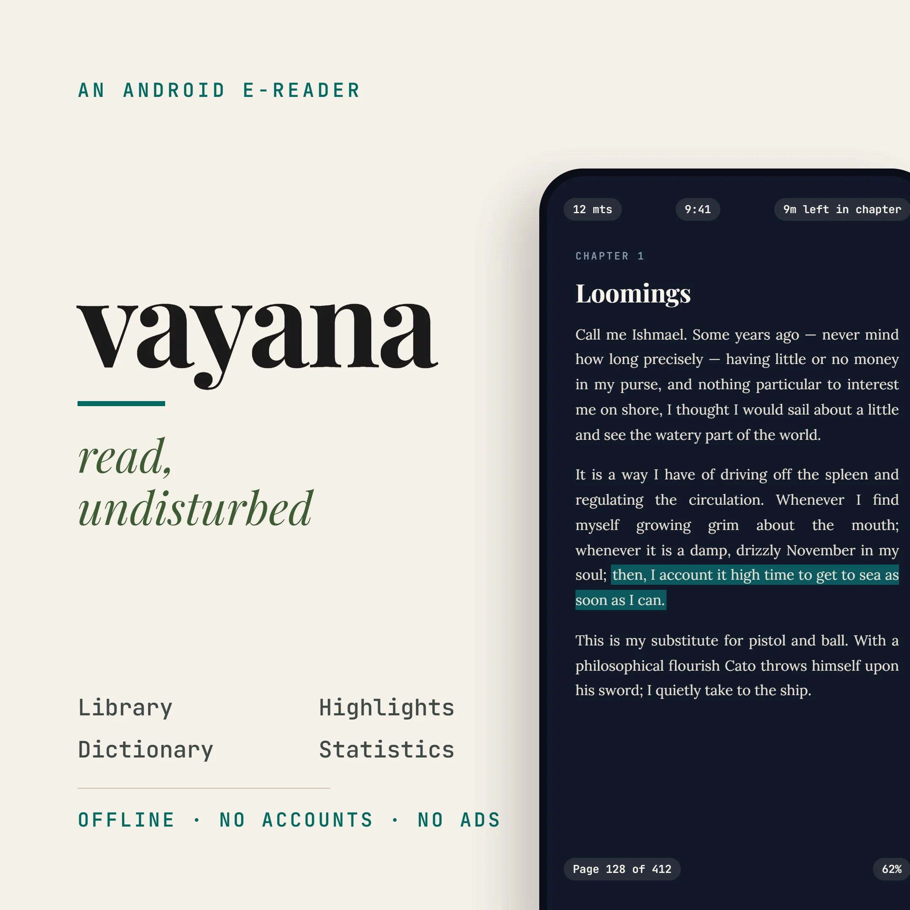
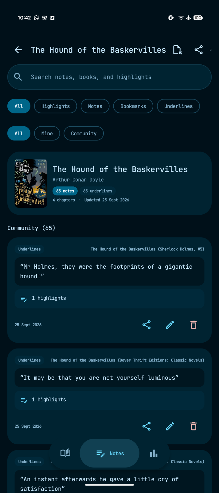
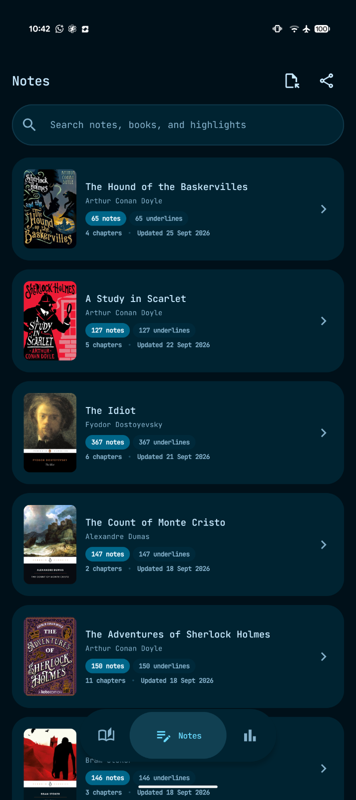
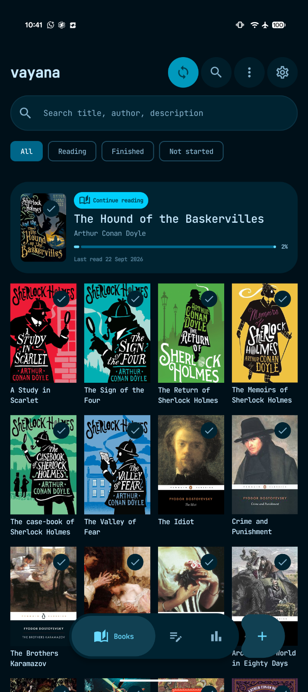
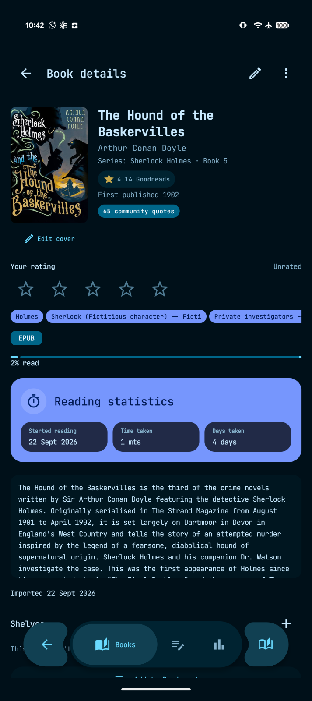

<div align="center">
  <picture>
    <source media="(prefers-color-scheme: dark)" srcset="core/resources/src/main/res/drawable-nodpi/vayana_share_dark_reader.webp">
    <source media="(prefers-color-scheme: light)" srcset="core/resources/src/main/res/drawable-nodpi/vayana_share_light.webp">
    
  </picture>

  <h1>Vayana</h1>

  <p><strong>Lee sin interrupciones.</strong></p>
  <p>Un lector de <a href="docs/USER_GUIDE.es.md#reading-epub-books">EPUB</a> y <a href="docs/USER_GUIDE.es.md#reading-pdf-books">PDF</a> para Android, tranquilo y centrado en el almacenamiento local, diseñado para pantallas convencionales y <a href="docs/USER_GUIDE.es.md#e-ink-and-accessibility">dispositivos E‑Ink</a>.</p>

  <p>
    <a href="https://github.com/rjwarrier/Vayana/releases/latest"><strong>Descargar la última versión</strong></a> ·
    <a href="https://ranjithj.in/vayana/"><strong>Sitio web de Vayana</strong></a> ·
    <a href="https://github.com/rjwarrier/Vayana/releases/tag/v0.87">Notas de la versión</a> ·
    <a href="docs/USER_GUIDE.es.md">Guía de usuario</a> ·
    <a href="docs/FEATURES.md">Documentación de funciones</a> ·
    <a href="docs/GITHUB_SYNC_SETUP.md">Configurar la sincronización con GitHub</a>
  </p>

  <p>
    
    
    
    
  </p>

  <p><a href="https://www.buymeacoffee.com/ranjithj"></a></p>
</div>

[English](README.md) · **Español** · [Português (Brasil)](README.pt.md)

<a id="why-vayana"></a>

## ¿Por qué Vayana?

La mayoría de las aplicaciones de lectura se limitan a mostrar un libro. Vayana considera la lectura una práctica conectada: organiza lo que quieres leer, concéntrate en el texto, conserva pasajes significativos, aprende palabras nuevas, vuelve a lo que te importa y lleva tu progreso de forma segura entre dispositivos.

Vayana lo hace sin exigir una cuenta de Vayana ni mostrar anuncios mientras lees. Tu biblioteca es local de forma predeterminada. Las funciones opcionales en línea, como el [enriquecimiento con Goodreads](docs/USER_GUIDE.es.md#book-details-and-reading-status) y la [sincronización con GitHub administrada por ti](docs/USER_GUIDE.es.md#github-sync), permanecen bajo tu control.

<a id="latest-source-updates"></a>

## Últimas novedades del código fuente

El código actual incluye una [aplicación complementaria para Wear OS](docs/WEAR_OS.md) para leer libros físicos: temporizadores sin conexión, seguimiento de páginas, controles compartidos entre teléfono y reloj, objetivos de lectura, una tarjeta y una complicación para la esfera. Las correcciones recientes de sincronización conservan el tiempo de lectura entre dispositivos y gestionan de forma segura los retrocesos del reloj. Consulta los [cambios desde v0.87](docs/releases/UNRELEASED.md).

La versión publicada **v0.87** solo contiene actualmente el APK para teléfono. Compila las aplicaciones actuales de teléfono y reloj para usar las funciones complementarias; consulta la [configuración de Wear OS](docs/WEAR_OS.md#install-and-build). La aplicación del reloj registra sesiones de lectura de libros físicos; no muestra libros EPUB ni PDF.

<a id="highlights-in-087"></a>

## Lo más destacado de 0.87

- Lee libros [**EPUB**](docs/USER_GUIDE.es.md#reading-epub-books) y [**PDF**](docs/USER_GUIDE.es.md#reading-pdf-books), con índices PDF, selección de texto, anotaciones, consultas al diccionario, zoom y controles de visualización por libro.
- Busca y descarga libros de dominio público mediante [**Project Gutenberg**](docs/USER_GUIDE.es.md#download-free-books-from-project-gutenberg), o conecta [**catálogos OPDS**](docs/USER_GUIDE.es.md#connect-an-opds-catalog) como Calibre, Calibre-Web y Standard Ebooks.
- Mantén una biblioteca única para libros digitales, [sin archivo digital, físicos y prestados](docs/USER_GUIDE.es.md#offline-physical-borrowed-and-other-books), con recordatorios de devolución y una copia opcional de solo lectura de [**Home Library**](docs/USER_GUIDE.es.md#home-library-mirror).
- [Consulta y traduce palabras o frases](docs/USER_GUIDE.es.md#dictionary-translation-and-vocabulary) en el idioma del libro mediante el diccionario sin conexión, Wiktionary, Wikipedia o herramientas de traducción.
- Retoma la lectura, controla la lectura en voz alta y consulta el tiempo de lectura de siete días desde [**widgets y accesos directos de la pantalla de inicio**](docs/USER_GUIDE.es.md#widgets-and-app-shortcuts) configurables.
- Registra cierres inesperados y fallos de sincronización en la pantalla [**Diagnóstico**](docs/USER_GUIDE.es.md#diagnostics-and-support), diseñada teniendo en cuenta la privacidad, y comparte un informe con datos sensibles ocultos con el desarrollador.
- Usa Vayana en [inglés, español, portugués, ruso, alemán, francés, italiano, malayalam o tamil](docs/USER_GUIDE.es.md#settings-and-languages).

<a id="screenshots"></a>

## Capturas de pantalla

<table>
  <tr>
    <td width="50%" align="center">
      <br>
      <sub><a href="docs/USER_GUIDE.es.md#highlights-notes-bookmarks-and-quotes"><strong>Resaltados y notas</strong></a>: busca, filtra, edita, comparte y distingue las anotaciones personales de las citas de la comunidad.</sub>
    </td>
    <td width="50%" align="center">
      <br>
      <sub><a href="docs/USER_GUIDE.es.md#notes-library"><strong>Biblioteca de notas</strong></a>: explora las anotaciones por libro y consulta de un vistazo los recuentos de capítulos y notas.</sub>
    </td>
  </tr>
  <tr>
    <td width="50%" align="center">
      <br>
      <sub><a href="docs/USER_GUIDE.es.md#managing-the-library"><strong>Biblioteca</strong></a>: continúa leyendo, busca y filtra una colección organizada en torno a las portadas.</sub>
    </td>
    <td width="50%" align="center">
      <br>
      <sub><a href="docs/USER_GUIDE.es.md#book-details-and-reading-status"><strong>Detalles del libro</strong></a>: metadatos, citas de la comunidad, valoración personal, progreso y estadísticas de lectura en un solo lugar.</sub>
    </td>
  </tr>
</table>

<a id="what-makes-it-different"></a>

## Qué lo hace diferente

<a id="a-real-eink-mode"></a>

### [Un verdadero modo E‑Ink](docs/USER_GUIDE.es.md#e-ink-and-accessibility)

E‑Ink es un perfil de pantalla propio, no un simple filtro de color:

- Se elimina el movimiento continuo; la línea ondulada de progreso de lectura se muestra estática.
- La animación al pasar página se desactiva y el reloj del lector solo se actualiza al cambiar de página.
- Elige **Monocromo** o **Color** en **Ajustes → Apariencia → Paleta E-ink**, o durante la configuración inicial. Monocromo sigue siendo la opción predeterminada: las portadas usan una escala de grises de alto contraste y los resaltados se convierten en marcas negras diferenciadas por su forma. Color conserva las portadas, ilustraciones, resaltados y acentos del tema en paneles E-Ink en color.
- Ambas paletas conservan el comportamiento de movimiento, paginación y actualización de E-Ink; la compatibilidad con color no vuelve a activar las animaciones.
- E-Ink en color utiliza una paleta específica de alto contraste: superficies neutras, texto negro/blanco, contornos sólidos y acentos verde azulado, azules y granates. Admite temas claros y oscuros; en este perfil se omiten los colores del fondo de pantalla y las variantes de superficie OLED. Se conservan las portadas y los temas de página elegidos. Las comprobaciones digitales de contraste no sustituyen las pruebas en el panel con su luz frontal y ajustes de actualización.
- Las teclas físicas de página cambian las páginas del lector y permiten avanzar por pantallas largas de la aplicación.
- Biblioteca, Notas, Búsqueda, Ajustes, Estanterías y Estadísticas incorporan controles para avanzar una pantalla cada vez.
- Las actualizaciones de limpieza del lector pueden ejecutarse cada cierto número de páginas y en transiciones de capítulos o menús.
- Los controles tipográficos incluyen texto más grueso, alineación y separación de palabras con guiones.

<a id="reading-that-becomes-learning"></a>

### [Una lectura que se convierte en aprendizaje](docs/USER_GUIDE.es.md#dictionary-translation-and-vocabulary)

- Toca dos veces una palabra para consultar el diccionario sin conexión incluido; las palabras que falten se pueden buscar en Wiktionary o Wikipedia con un toque.
- Guarda las palabras consultadas directamente en un conjunto de repaso espaciado.
- Descubre palabras poco habituales del capítulo actual con sus definiciones.
- Exporta el vocabulario a CSV compatible con Anki o a Markdown legible.
- Repasa tus resaltados a intervalos espaciados: **Ver pronto**, **Entendido** o **Lo sé bien**.
- Al regresar tras un tiempo, consulta un resumen con un resaltado reciente y vocabulario pendiente de repaso.

<a id="read-aloud-that-follows-the-book"></a>

### [Lectura en voz alta que sigue el libro](docs/USER_GUIDE.es.md#read-aloud)

- La síntesis de voz de Android lee frase por frase y avanza entre capítulos.
- Las palabras o frases pronunciadas se marcan directamente en el texto.
- Inicia la reproducción desde un pasaje seleccionado; toca cualquier parte del lector para pausar.
- Elige el motor TTS instalado, la voz, la velocidad y el tono.
- Usa un temporizador de apagado, gestión del foco de audio, controles de auriculares/Bluetooth, controles en la pantalla de bloqueo y acciones de notificación.

<a id="sync-without-a-proprietary-service"></a>

### [Sincronización sin un servicio propietario](docs/USER_GUIDE.es.md#github-sync)

Usa un repositorio de GitHub bajo tu control para sincronizar:

- Posición de lectura, sesiones y fechas de lectura
- Libros, portadas y metadatos de la biblioteca
- Resaltados, notas, estanterías y Próximas lecturas
- Vocabulario y ajustes portables
- Eliminaciones y restauraciones entre dispositivos

Los archivos de libros y portadas se cifran con AES-GCM usando tu frase de contraseña antes de subirse. La sincronización ligera del progreso puede ejecutarse mientras lees, y los mensajes de conflicto identifican la posición más reciente junto con la hora de sincronización y el nombre del dispositivo. La propia configuración de sincronización se puede exportar como un archivo de transferencia cifrado para otro dispositivo.

Sigue la [guía paso a paso de sincronización con GitHub](docs/GITHUB_SYNC_SETUP.md) para crear un repositorio privado, configurar un token con los permisos mínimos, conectar el primer dispositivo y añadir otros de forma segura.

<a id="features"></a>

## Funciones

| Área | Características principales |
| --- | --- |
| [**Biblioteca**](docs/USER_GUIDE.es.md#managing-the-library) | Importación EPUB/PDF, exploración de carpetas, **Abrir con** de Android, detección de duplicados, vistas de cuadrícula/lista, filtros, ordenación, lectura actual, Próximas lecturas, estanterías, carpetas de series y Eliminados recientemente |
| [**Libros sin archivo digital y físicos**](docs/USER_GUIDE.es.md#offline-physical-borrowed-and-other-books) | Registro de libros sin archivo local, progreso y temporizadores, estado propio/prestado, fechas de devolución y recordatorios; copia opcional del catálogo compartido por Home Library |
| [**Detalles del libro**](docs/USER_GUIDE.es.md#book-details-and-reading-status) | Metadatos, series y etiquetas editables, valoraciones, fechas de lectura, tiempo dedicado, portadas personalizadas, sustitución del archivo de origen, compartir archivos y tarjetas visuales de lectura |
| [**Goodreads**](docs/USER_GUIDE.es.md#book-details-and-reading-status) | Vista previa e importación de detalles de series, géneros, descripción, portada, año de publicación, valoración y citas populares; alternativa mediante navegador cuando se bloquea la consulta directa |
| [**Descubrimiento de libros**](docs/USER_GUIDE.es.md#adding-books) | Explora y descarga desde Project Gutenberg por tema o idioma, y conecta catálogos OPDS como Calibre, Calibre-Web y Standard Ebooks |
| [**Lector EPUB**](docs/USER_GUIDE.es.md#reading-epub-books) | Navegación por el índice, posición guardada, preferencias por libro, fuentes importadas, temas, márgenes, encabezados/pies, estilos editoriales, zonas de toque, teclas de volumen, pantalla completa y dos columnas en horizontal |
| [**Lector PDF**](docs/USER_GUIDE.es.md#reading-pdf-books) | Navegación por páginas e índice, ajuste/zoom, selección de texto, diccionario, resaltados, subrayados, notas, marcadores, copia y tarjetas de citas en PDF con texto |
| [**Tipografía**](docs/USER_GUIDE.es.md#typography-and-page-appearance) | Familia y tamaño de fuente, altura de línea, fuentes personalizadas, alineación, separación con guiones, texto más grueso y lectura biónica opcional |
| [**Anotaciones**](docs/USER_GUIDE.es.md#highlights-notes-bookmarks-and-quotes) | Resaltados, subrayados, marcadores, notas, etiquetas de anotaciones, combinación de resaltados superpuestos, ventanas de notas al pie y regreso directo al pasaje |
| [**Notas y citas**](docs/USER_GUIDE.es.md#notes-library) | Vistas de Notas globales y por libro, importación de `My Clippings.txt` de Kindle, exportación Markdown, importación de citas de Goodreads e imágenes de tarjetas de citas para compartir |
| [**Diccionario y traducción**](docs/USER_GUIDE.es.md#dictionary-translation-and-vocabulary) | Consulta sin conexión según el idioma del libro, búsqueda de frases, alternativas Wiktionary/Wikipedia, traducción, vocabulario guardado, palabras del capítulo, repaso espaciado, registro de palabras conocidas y exportación Anki/Markdown |
| [**Lectura en voz alta**](docs/USER_GUIDE.es.md#read-aloud) | TTS de Android que sigue las frases, avanza de capítulo, comienza desde la selección y ofrece temporizador, controles de voz/velocidad/tono, foco de audio, auriculares/Bluetooth y notificaciones |
| [**Búsqueda**](docs/USER_GUIDE.es.md#search) | Búsqueda rápida de texto completo en libros, metadatos, texto resaltado, notas y nombres de capítulos, con coincidencias por prefijo y búsquedas recientes |
| [**Estadísticas**](docs/USER_GUIDE.es.md#statistics-and-goals) | Tiempo y sesiones de lectura, rachas, objetivos diarios/anuales, libros terminados, actividad por fecha, historial por libro y almacenamiento usado (libros, portadas, notas y citas, diccionario, caché; libro más grande/más pequeño y por formato) |
| [**Widgets y accesos directos**](docs/USER_GUIDE.es.md#widgets-and-app-shortcuts) | Continuar leyendo con reproducción/pausa de lectura en voz alta, gráfico adaptable de siete días de tiempo de lectura y accesos directos a destinos principales de la biblioteca |
| [**Copias de seguridad**](docs/USER_GUIDE.es.md#backup-and-restore) | Copias/restauración manuales mediante ZIP portable y copias automáticas en una carpeta elegida, con frecuencia diaria, semanal o cada 30 días y controles de conservación |
| [**Diagnóstico**](docs/USER_GUIDE.es.md#diagnostics-and-support) | Historial local de cierres inesperados y sincronización, detalles del entorno, ocultación de datos sensibles, copiar/compartir y acceso al soporte del desarrollador con un toque |
| [**Idiomas**](docs/USER_GUIDE.es.md#settings-and-languages) | Selección de idioma dentro de la aplicación: inglés, español, portugués, ruso, alemán, francés, italiano, malayalam y tamil |
| [**Apariencia**](docs/USER_GUIDE.es.md#settings-and-languages) | Material 3, modos sistema/claro/oscuro, negro puro, color Material You opcional, perfiles Estándar/E‑Ink, controles de movimiento y navegación adaptable a teléfonos/tabletas |

Vayana también permite [registrar libros físicos y prestados](docs/USER_GUIDE.es.md#offline-physical-borrowed-and-other-books) sin archivo digital, con progreso, fechas, valoraciones, notas y estadísticas.

<a id="install"></a>

## Instalación

Vayana admite **Android 8.0 (API 26) y versiones posteriores**.

Para una introducción al primer uso, consulta la [guía de inicio rápido](docs/USER_GUIDE.es.md#quick-start).

1. Abre la [última versión en GitHub](https://github.com/rjwarrier/Vayana/releases/latest).
2. Descarga `Vayana-v0.87.apk`.
3. Si Android lo solicita, permite la instalación desde el navegador o gestor de archivos y abre el APK.

Android puede avisar de que la aplicación no procede de Google Play. Los archivos de la versión incluyen un archivo `.sha256` para comprobar la descarga antes de instalarla.

Para v0.87:

```text
SHA-256 del APK
783642D1B39F7941CE0C0A97EACB31CFE3163D50504051012F6E84D5EADEA909

SHA-256 del certificado de la versión
53:2C:F4:07:D5:F0:D1:21:58:8A:5C:F1:6E:61:12:C8:F1:BB:3B:7E:D9:CF:F1:39:80:6A:7B:63:C6:43:96:C7
```

<a id="current-scope"></a>

## Alcance actual

- **Formatos de libros electrónicos legibles:** [EPUB](docs/USER_GUIDE.es.md#reading-epub-books) y [PDF](docs/USER_GUIDE.es.md#reading-pdf-books). Los PDF escaneados sin capa de texto permiten visualizar, ampliar y añadir marcadores, pero no seleccionar texto. Los [libros físicos](docs/USER_GUIDE.es.md#offline-physical-borrowed-and-other-books) se pueden registrar sin archivo.
- **Acceso en línea:** La lectura básica, notas, diccionario y estadísticas funcionan localmente. [Project Gutenberg](docs/USER_GUIDE.es.md#download-free-books-from-project-gutenberg), [OPDS](docs/USER_GUIDE.es.md#connect-an-opds-catalog), Goodreads, búsqueda de portadas, traducción, consultas a Wiktionary/Wikipedia y [sincronización con GitHub](docs/USER_GUIDE.es.md#github-sync) necesitan Internet cuando se usan; el texto seleccionado solo se envía al proveedor cuando eliges esa acción. Consulta la [guía de privacidad y servicios en línea](docs/USER_GUIDE.es.md#privacy-and-online-services).
- **Actualización E‑Ink:** Se ha implementado el [comportamiento E‑Ink portable](docs/USER_GUIDE.es.md#e-ink-display-profile). Aún no se integran modos de actualización específicos del fabricante, como los SDK de Onyx/Boox.
- **Historial en la nube:** Los archivos cifrados eliminados permanentemente pueden permanecer en commits anteriores del repositorio de sincronización, ya que el historial de Git es inmutable salvo que se reescriba. Consulta las [limitaciones actuales](docs/USER_GUIDE.es.md#current-limitations).

<a id="build-from-source"></a>

## Compilar desde el código fuente

<a id="requirements"></a>

### Requisitos

- JDK 17 o posterior
- Android SDK 37
- Git

Clona el repositorio y compila un APK de depuración con el wrapper de Gradle incluido:

```bash
git clone https://github.com/rjwarrier/Vayana.git
cd Vayana
./gradlew :app:assembleDebug
```

En Windows:

```powershell
.\gradlew.bat :app:assembleDebug
```

El APK de depuración se genera en `app/build/outputs/apk/debug/`.

Para compilar también la aplicación del reloj, ejecuta `./gradlew :app:assembleDebug :wear:assembleDebug`
(o `.\gradlew.bat :app:assembleDebug :wear:assembleDebug` en Windows).
Instala `wear/build/outputs/apk/debug/wear-debug.apk` en el reloj. Ambas aplicaciones deben
usar el mismo certificado de firma; consulta [instalación y verificación](docs/WEAR_OS.md#install-and-build).

<a id="release-signing"></a>

### Firma de versiones

Las credenciales de publicación se mantienen fuera de Git. Configura la compilación para usar un archivo local de propiedades Java mediante `VAYANA_KEYSTORE_PROPERTIES`, como propiedad de Gradle o variable de entorno:

```properties
storeFile=/absolute/path/to/release-keystore
storePassword=...
keyAlias=...
keyPassword=...
storeType=PKCS12
```

```bash
./gradlew :app:assembleRelease \
  -PVAYANA_KEYSTORE_PROPERTIES=/absolute/path/to/keystore.properties
```

Si no se indica una ruta externa, la compilación busca un archivo `keystore.properties` ignorado por Git en la raíz del repositorio.

<a id="project-structure"></a>

## Estructura del proyecto

```text
app/                    Estructura de la aplicación del teléfono y navegación
wear/                   Aplicación complementaria Wear OS para lectura física
core/wear/              Temporizador, sesiones y protocolo Data Layer compartidos
core/                   Base de datos, ajustes, archivos, copias, sincronización, diagnóstico, integración Home Library y sistema de diseño
feature/                Biblioteca, lector, descubrimiento, notas, recordatorios, búsqueda, estadísticas, ajustes y configuración inicial
reader/engine-api/      Contrato del motor de lectura
reader/engine-web/      Motor EPUB basado en Foliate y puente WebView
format/epub/            Metadatos EPUB e importación
format/pdf/             Metadatos PDF, representación y texto
format/convert/         Conversión compartida de documentos
dictionary/             API de diccionario, implementación StarDict incluida y consultas en línea
build-logic/            Convenciones compartidas de compilación Android y Kotlin
```

La aplicación usa Kotlin, Jetpack Compose, Material 3, Room, DataStore, Hilt, WorkManager y una selección integrada del motor de representación EPUB de Foliate.

<a id="documentation"></a>

## Documentación

- [Sitio web de Vayana](https://ranjithj.in/vayana/)
- [Guía de usuario y ayuda detallada de funciones](docs/USER_GUIDE.es.md)
- [Índice de documentación](docs/README.md)
- [Comportamiento de las funciones y reglas invariantes](docs/FEATURES.md)
- [Configuración y uso de la aplicación Wear OS](docs/WEAR_OS.md)
- [Cambios desde v0.87](docs/releases/UNRELEASED.md)
- [Configuración de sincronización con GitHub](docs/GITHUB_SYNC_SETUP.md)
- [Decisiones de arquitectura e implementación](docs/DECISIONS.md)
- [Registro de cambios de la base de datos](docs/DATABASE_CHANGELOG.md)
- [Diseño de sincronización con GitHub](docs/GITHUB_SYNC_IMPLEMENTATION_PLAN.md)
- [Notas de la versión v0.87](https://github.com/rjwarrier/Vayana/releases/tag/v0.87)
- [Notas de la versión v0.85](docs/releases/v0.85.md)

<a id="feedback"></a>

## Comentarios y sugerencias

Usa [GitHub Issues](https://github.com/rjwarrier/Vayana/issues) para errores reproducibles y solicitudes de funciones concretas. Al informar de problemas del lector o de sincronización, incluye la versión de Android, el modelo del dispositivo, el perfil de pantalla y la [exportación de diagnóstico](docs/USER_GUIDE.es.md#diagnostics-and-support), si está disponible; nunca incluyas un token de GitHub ni la frase de contraseña de sincronización.

<a id="support"></a>

## Apoyo

Si Vayana te resulta útil, puedes apoyar su desarrollo:

<a href="https://www.buymeacoffee.com/ranjithj"></a>
