

# Guia do usuário do Vayana

[English](USER_GUIDE.md) · [Español](USER_GUIDE.es.md) · **Português (Brasil)** · [Français](USER_GUIDE.fr.md) · [Deutsch](USER_GUIDE.de.md) · [README em português](../README.pt.md)

Este guia descreve os recursos disponíveis no Vayana 0.90 e explica os procedimentos mais comuns de leitura, biblioteca, backup, sincronização e suporte. O Vayana é um leitor Android de EPUB e PDF com prioridade ao armazenamento local. Ele também registra livros físicos, emprestados, audiolivros e outros livros sem exigir um arquivo digital.

> **Versão 0.90:** Baixe os dois APKs assinados na [página da versão](https://github.com/rjwarrier/Vayana/releases/tag/v0.90) para o [aplicativo complementar Wear OS](WEAR_OS.md). Veja as [notas da versão](releases/v0.90.md) para as mudanças desde a v0.87.

> As capturas deste guia foram feitas em um dispositivo de desenvolvimento com livros em domínio público do Project Gutenberg. O layout pode variar conforme o tamanho da tela, a versão do Android, o tema, o idioma e as configurações E-Ink.

## Conteúdo

- [Início rápido](#quick-start)
- [Navegação](#navigation)
- [Adicionar livros](#adding-books)
- [Gerenciar a biblioteca](#managing-the-library)
- [Detalhes do livro e status de leitura](#book-details-and-reading-status)
- [Ler livros EPUB](#reading-epub-books)
- [Ler livros PDF](#reading-pdf-books)
- [Destaques, notas, marcadores e citações](#highlights-notes-bookmarks-and-quotes)
- [Dicionário, tradução e vocabulário](#dictionary-translation-and-vocabulary)
- [Leitura em voz alta](#read-aloud)
- [Busca](#search)
- [Estatísticas e metas](#statistics-and-goals)
- [Aplicativo complementar Wear OS](#wear-os-companion)
- [Widgets e atalhos do aplicativo](#widgets-and-app-shortcuts)
- [Backup e restauração](#backup-and-restore)
- [Sincronização com o GitHub](#github-sync)
- [E-Ink e acessibilidade](#e-ink-and-accessibility)
- [Configurações e idiomas](#settings-and-languages)
- [Diagnóstico e suporte](#diagnostics-and-support)
- [Privacidade e serviços on-line](#privacy-and-online-services)
- [Solução de problemas](#troubleshooting)
- [Limitações atuais](#current-limitations)

## Início rápido

1. Instale o APK da [versão mais recente no GitHub](https://github.com/rjwarrier/Vayana/releases/latest).
2. Conclua a configuração inicial e escolha o perfil de tela adequado ao dispositivo: **Padrão** ou **E-Ink**.
3. Abra **Livros** e toque em **Adicionar livros**.
4. Importe um EPUB/PDF, busque em uma pasta ou escolha **Livros gratuitos** para explorar o Project Gutenberg.
5. Toque em uma capa para abrir **Detalhes do livro** e escolha **Continuar lendo**.
6. Toque no centro de uma página EPUB para mostrar as ferramentas do leitor e os controles de aparência.

O Vayana armazena a biblioteca localmente por padrão. Não é necessário ter uma conta. Backup, sincronização com o GitHub, Goodreads, Project Gutenberg, OPDS, consultas Wikimedia e tradução são opcionais.

<table>
  <tr>
    <td width="50%" align="center">
      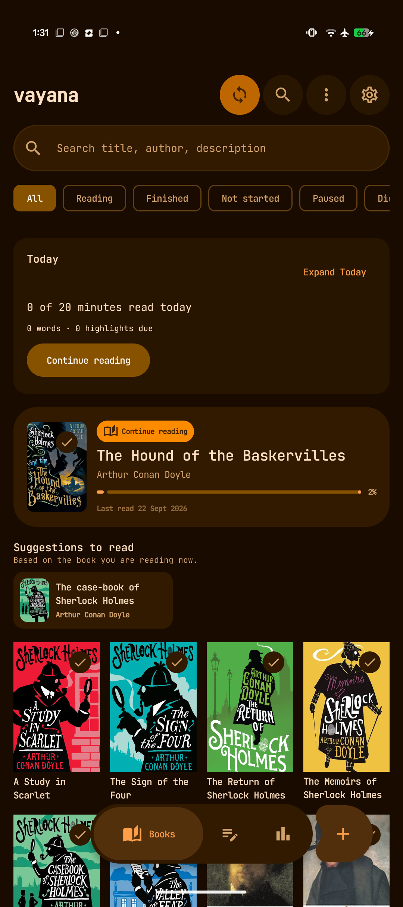 
      <strong>Biblioteca</strong>: status de leitura, Continuar lendo, sugestões, filtros e capas.
    </td>
    <td width="50%" align="center">
      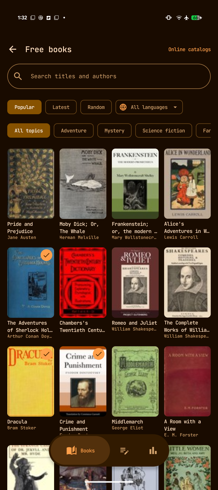 
      <strong>Livros gratuitos</strong>: explore títulos em domínio público por popularidade, tema ou idioma.
    </td>
  </tr>
</table>

## Navegação

O layout compacto para celulares tem três destinos principais:

- **Livros** abre o painel de leitura e a biblioteca.
- **Notas** agrupa destaques, sublinhados e notas por livro.
- **Estatísticas** mostra tempo de leitura, sequências de dias, metas, livros concluídos e uso de armazenamento.

O botão **Adicionar livros** aparece ao lado da navegação principal. A barra de ferramentas da biblioteca também oferece:

- **Sincronizar agora** para a sincronização com o GitHub já configurada.
- **Buscar** na biblioteca e nos dados de leitura.
- **Mais ações da biblioteca** para visualizações como Próximas leituras, estantes, livros sem arquivo digital e Excluídos recentemente.
- **Configurações** de aparência, comportamento do leitor, backup, sincronização, metas, Ajuda, Sobre e Diagnóstico.

Em telas maiores, o Vayana usa layouts adaptáveis, navegação lateral e visualizações de lista/detalhes quando há espaço. É possível ativar um layout de leitor/notas em duas colunas para telas largas na horizontal.

## Adicionar livros

### Importar arquivos EPUB ou PDF

Em **Livros → Adicionar livros**:

- **Importar livros** abre o seletor de arquivos do Android para escolher um ou mais EPUBs/PDFs.
- **Importar pasta** examina uma pasta selecionada e importa os livros compatíveis encontrados.
- **Abrir com** do Android e **Compartilhar com o Vayana** permitem importar um arquivo compatível de outro aplicativo.
- **Substituir origem**, em Detalhes do livro, substitui um arquivo ausente ou atualizado, preservando o registro da biblioteca e os dados de leitura do Vayana sempre que possível.

O Vayana detecta possíveis importações duplicadas. Mantenha os arquivos originais disponíveis até a importação terminar. PDFs protegidos por senha são indicados como incompatíveis.

### Baixar livros gratuitos do Project Gutenberg

Abra **Livros → Adicionar livros → Livros gratuitos**. Você pode:

- Pesquisar por título ou autor.
- Alternar entre as listas **Populares**, **Recentes** e **Aleatórios**.
- Filtrar por idioma e temas como aventura, mistério, ficção científica, fantasia, poesia ou literatura infantil.
- Abrir um título, comparar as edições disponíveis e escolher versões com ou sem imagens.
- Ver quais livros já estão na biblioteca do Vayana.
- Continuar explorando um catálogo em cache quando o Project Gutenberg estiver temporariamente indisponível.

Os títulos do Project Gutenberg podem estar livres de direitos autorais nos Estados Unidos, mas não necessariamente em outros países. Verifique as regras de direitos autorais onde você mora.

### Conectar um catálogo OPDS

Escolha **Catálogos on-line** na tela Livros gratuitos. Adicione o endereço OPDS fornecido por um serviço como:

- Servidor de conteúdo do Calibre
- Calibre-Web
- Standard Ebooks
- Outro catálogo OPDS compatível

Abra um catálogo para explorar seus feeds de navegação, pesquisar quando o servidor permitir e baixar livros EPUB ou PDF compatíveis. A autenticação e a disponibilidade dependem do servidor do catálogo.

  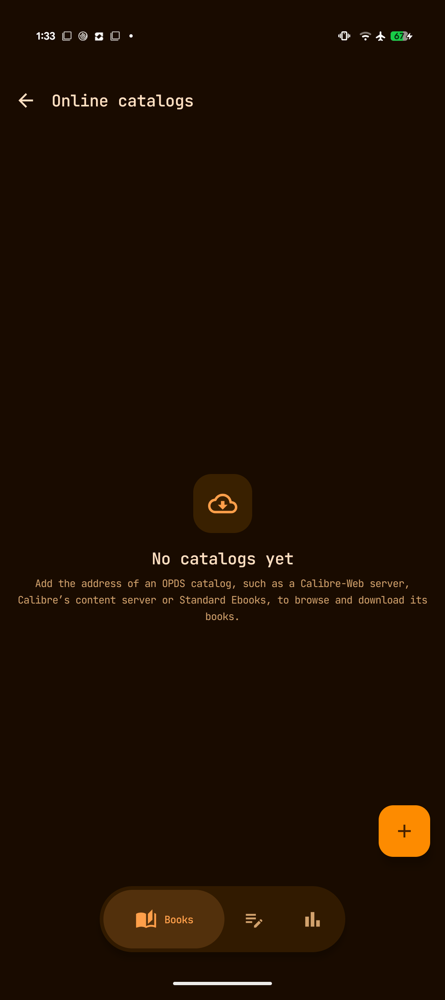 
  Adicione Calibre, Calibre-Web, Standard Ebooks ou outro catálogo OPDS.

## Gerenciar a biblioteca

### Painel e filtros

A biblioteca combina o catálogo com um painel de leitura:

- **Hoje** mostra o progresso da meta diária de leitura e os itens pendentes de revisão.
- **Continuar lendo** retorna ao livro disponível localmente usado mais recentemente.
- **Sugestões de leitura** usa o contexto atual da biblioteca para apresentar livros relacionados.
- Os filtros de status incluem **Todos**, **Lendo**, **Concluídos**, **Não iniciados**, **Pausados** e **Não concluídos**.
- A busca encontra correspondências no título, autor e descrição.
- A visualização em grade/lista, a ordenação, as estantes, as séries, Próximas leituras e outros filtros ajudam a organizar bibliotecas maiores.

### Próximas leituras, estantes e séries

- Adicione livros a **Próximas leituras** e reorganize a fila.
- Crie estantes para coleções pessoais e filtros.
- Use os metadados de séries para agrupar livros relacionados e preservar a ordem da série.
- Um livro pode manter tags, avaliação, datas, progresso, notas e estatísticas de leitura junto com os metadados do arquivo.

### Livros sem arquivo digital, físicos, emprestados e outros

Os registros de livros sem arquivo digital não exigem um EPUB ou PDF. Use-os para livros de papel, audiolivros ou formatos lidos em outro aplicativo. Você pode registrar:

- Título, autor, capa, série, tags e quantidade de páginas
- Status e datas de leitura
- Páginas lidas ou percentual de progresso
- Avaliações, notas e sessões de leitura
- Status **Próprio** ou **Emprestado**
- Data de devolução de livros emprestados

Quando ativados, os lembretes de empréstimo podem avisar três dias antes, um dia antes e na data de devolução.

### Espelhamento do Home Library

Se o aplicativo Home Library do desenvolvedor estiver instalado no mesmo dispositivo e o compartilhamento estiver ativado, o Vayana poderá espelhar esse catálogo em Livros sem arquivo digital:

- Ative **Sincronizar com o Home Library** nas Configurações.
- Os campos do catálogo espelhado são somente leitura; o Home Library continua responsável por esses dados.
- O Vayana mantém seu próprio progresso, datas, estado de Próximas leituras, notas e estatísticas.
- A localização na estante e os metadados compartilhados aparecem na busca e em Detalhes do livro.
- **Ver no Home Library** retorna ao registro de origem.

## Detalhes do livro e status de leitura

Detalhes do livro reúne metadados e atividade de leitura. Dependendo do livro, pode mostrar:

- Capa, título, autor, série, formato e progresso
- Descrição, dados da editora, tags, assuntos e metadados personalizados
- Avaliação pessoal e status de leitura
- Datas de início, conclusão e última leitura
- Tempo de leitura e progresso atual
- Notas, destaques, citações e contagens de capítulos
- Ações de arquivo, substituição de origem, compartilhamento e edição de capa
- Metadados, avaliação, gêneros, dados de séries e citações da comunidade do Goodreads, opcionalmente

Alterações nos metadados e na capa afetam o registro local do Vayana, a menos que o livro seja um espelhamento somente leitura do Home Library.

  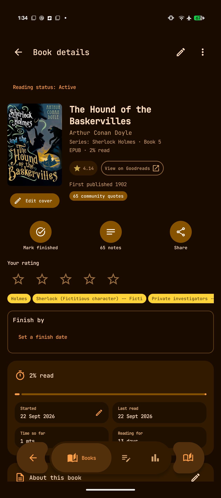 
  Detalhes do livro combina metadados, status, progresso, datas, notas e ações.

## Ler livros EPUB

O leitor EPUB do Vayana lembra a posição de cada livro e é compatível com texto reajustável, EPUBs de layout fixo e opções de apresentação por livro.

### Navegação do leitor

- Toque ou deslize para mudar de página conforme as zonas de toque e o comportamento configurados.
- Use as teclas físicas de volume/página quando estiverem ativadas.
- Abra **Sumário** para ir a um capítulo.
- Adicione marcadores e volte a eles.
- Pesquise no livro atual.
- Veja o progresso por página/posição e porcentagem.
- Configure tela cheia, informações de cabeçalho/rodapé e manutenção da tela ligada conforme sua preferência.
- Na horizontal, telas largas podem usar duas colunas.

Ao retornar depois de um tempo, o Vayana pode mostrar um breve resumo de **Bem-vindo de volta** com o último capítulo e o contexto recente de leitura.

### Tipografia e aparência da página

Abra **Configurações** dentro do leitor para ajustar:

- Tema da página: Sistema, Claro, Papel, Sépia, Menta ou outros temas disponíveis
- Família da fonte, fonte personalizada importada, tamanho e texto mais espesso
- Altura de linha, alinhamento, hifenização e margens laterais
- Estilos da editora e se o Vayana substitui a tipografia do livro
- Conteúdo do cabeçalho/rodapé e estilo do progresso da página
- Leitura biônica opcional
- Predefinições de leitura salvas e estilos personalizados por livro

As opções de tema podem ser aplicadas de forma geral, enquanto a opção de estilo personalizado preserva as escolhas tipográficas específicas do livro.

<table>
  <tr>
    <td width="50%" align="center">
      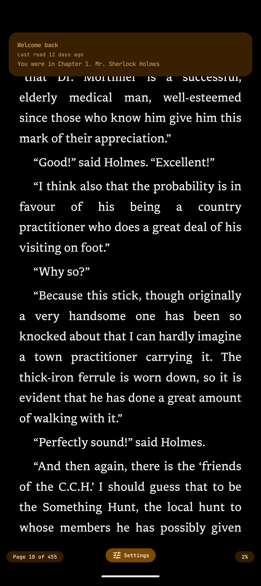 
      <strong>Leitor</strong>: texto sem distrações, com progresso e resumo ao retornar.
    </td>
    <td width="50%" align="center">
      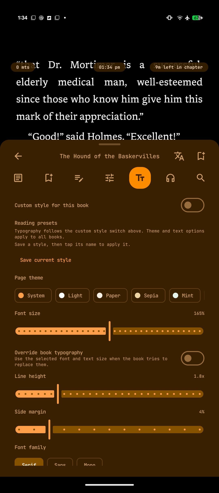 
      <strong>Controles do leitor</strong>: sumário, notas, progresso, estilo, leitura em voz alta e busca.
    </td>
  </tr>
</table>

## Ler livros PDF

Arquivos PDF podem ser importados pelo seletor de arquivos, busca em pastas, Abrir com, Compartilhar ou Substituir origem.

O leitor PDF oferece:

- Uma página por tela, com toques de página e navegação por teclas físicas
- Navegação pelo sumário PDF quando o documento o fornece
- Navegação por número de página e posição salva
- Ajuste à página, ajuste à largura, zoom e deslocamento
- Controles de brilho/luz quente nas bordas quando configurados
- Marcadores em todos os PDFs
- Seleção de texto, cópia, dicionário, destaques, sublinhados, notas e cartões de citações em PDFs com camada de texto
- Geração da capa pela primeira página e extração de título/autor dos metadados PDF quando disponíveis

PDFs de imagens digitalizadas sem camada de texto podem ser visualizados, ampliados, deslocados e marcados, mas não permitem selecionar ou pesquisar texto. As fontes e o espaçamento PDF fazem parte da página, portanto os controles tipográficos EPUB não se aplicam.

## Destaques, notas, marcadores e citações

### Durante a leitura

Selecione texto para acessar ações como:

- Destacar ou sublinhar
- Adicionar/editar uma nota
- Copiar ou compartilhar o texto selecionado
- Criar um cartão visual de citação
- Definir, pesquisar ou traduzir a seleção
- Adicionar tags de anotação

Destaques EPUB sobrepostos podem ser mesclados. Notas de rodapé podem abrir em pop-ups quando o livro permitir.

### Biblioteca de notas

O destino global **Notas** agrupa as anotações por livro e mostra contagens e datas de atualização. Ele permite:

- Pesquisar em notas, livros e texto destacado
- Filtrar e voltar diretamente ao trecho original
- Editar e compartilhar anotações
- Exportar para Markdown
- Gerar cadernos Markdown automáticos quando configurados
- Importar `My Clippings.txt` do Kindle
- Importar citações da comunidade do Goodreads, diferenciadas das anotações pessoais
- Revisar destaques em intervalos com **Ver em breve**, **Entendi** e **Conheço bem**

  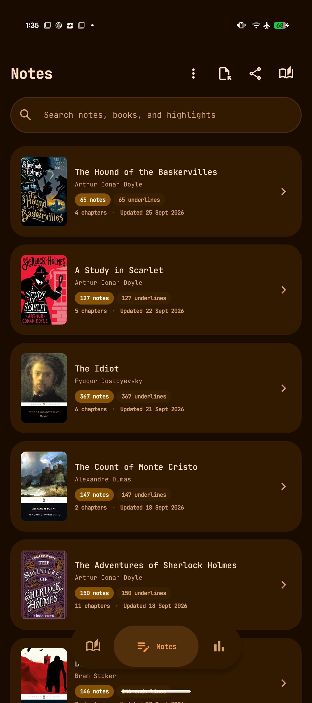 
  As notas são agrupadas por livro, com contagens de anotações e capítulos.

## Dicionário, tradução e vocabulário

- Toque duas vezes em uma palavra em uma visualização de texto compatível para abrir o dicionário off-line incluído.
- O Vayana usa o idioma do livro nas consultas quando os metadados de idioma estão disponíveis.
- Pesquise palavras ou frases selecionadas na Wiktionary ou na Wikipedia quando houver conexão com a Internet.
- Envie uma seleção para um aplicativo de tradução instalado.
- Salve as palavras consultadas na lista de vocabulário.
- Descubra palavras incomuns do capítulo atual.
- Marque termos familiares como conhecidos.
- Revise o vocabulário salvo em intervalos espaçados.
- Exporte o vocabulário como CSV compatível com Anki ou Markdown legível.

A consulta on-line envia apenas a pesquisa selecionada ao provedor escolhido quando você solicita. A tradução exige um aplicativo de tradução compatível.

## Leitura em voz alta

A síntese de voz do Android pode ler um EPUB frase por frase e continuar entre capítulos.

- Comece na posição atual ou em um trecho selecionado.
- Acompanhe a marcação da palavra/frase falada no texto.
- Escolha um mecanismo TTS instalado, idioma, voz, velocidade e tom.
- Use um temporizador de desligamento.
- Pause tocando no leitor.
- Controle a reprodução pelas notificações, tela de bloqueio, fone de ouvido ou controles Bluetooth.
- O foco de áudio pausa ou reduz o volume quando outro aplicativo precisa de áudio.
- O widget Continuar lendo pode iniciar ou pausar a leitura em voz alta do livro exibido.

As vozes e os idiomas disponíveis dependem dos mecanismos TTS instalados no dispositivo. A leitura em voz alta foi pensada principalmente para texto reajustável, não para PDFs digitalizados.

## Busca

A busca global pode encontrar:

- Títulos, autores, descrições, séries, tags e outros metadados
- Nomes de capítulos EPUB e texto de livros indexado
- Destaques e notas pessoais
- Consultas recentes e correspondências por prefixo

O conteúdo EPUB disponível localmente é indexado para buscas rápidas. O texto das páginas PDF e o conteúdo de livros físicos não são indexados, embora suas anotações pessoais ainda possam aparecer na busca de anotações.

## Estatísticas e metas

O Vayana registra sessões de leitura e apresenta:

- Tempo de leitura diário e total
- Sequências de dias de leitura e atividade em calendário
- Livros concluídos por mês e ano
- Metas diárias de minutos e anuais de livros
- Histórico de leitura por livro
- Armazenamento usado por livros, capas, notas/citações, dados de dicionário e cache
- Totais por formato e maiores/menores livros

As estatísticas se baseiam na atividade registrada pelo Vayana. Sessões de outro dispositivo podem contribuir após a sincronização.

  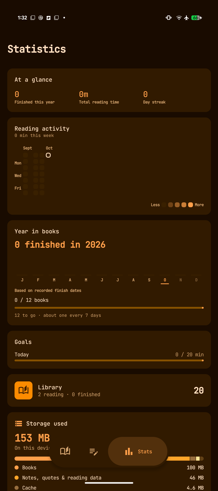 
  Atividade de leitura, metas, totais da biblioteca e uso de armazenamento.

## Aplicativo complementar Wear OS

O aplicativo complementar registra a leitura de livros físicos no Wear OS 3+, com Google Play Services e um celular Android pareado. Configure-o com compilações atuais compatíveis do celular e do relógio seguindo o [guia do Wear OS](WEAR_OS.md#install-and-build).

1. Adicione um livro físico no celular e marque-o como leitura atual.
2. Abra o Vayana no relógio e escolha **Sincronizar com o celular** (Sync with phone) para armazenar seus livros em cache.
3. Selecione um livro, confira a página inicial e toque em **Iniciar cronômetro** (Start timer). Cronômetros do relógio, pausas e edições de página funcionam off-line.
4. Toque em **Parar** (Stop), informe a página final e toque em **Salvar** (Save). Cancelar deixa pausado um cronômetro iniciado no relógio.
5. Reconecte para enviar as sessões salvas ao histórico e às estatísticas do celular. Sessões pendentes ficam no relógio até serem confirmadas.

Um cronômetro em execução no celular também pode aparecer no relógio, onde você pode pausá-lo, retomá-lo, pará-lo e atualizar sua página. Ações remotas aguardam a confirmação do dispositivo responsável; ver um cronômetro off-line não confirma que um comando foi aplicado. O celular também oferece controles para um cronômetro iniciado no relógio.

Use **Metas de leitura** (Reading goals) para definir uma meta diária ou um lembrete de sessão, e **Vibração** (Vibration) para a resposta tátil. O aplicativo inclui uma tela ambiente, um bloco de leitura e uma complicação para o mostrador. Para conflitos de página, revisão de sobreposições, recuperação após reinicialização e indicadores de conexão, veja o [guia completo do aplicativo complementar](WEAR_OS.md).

O relógio não abre arquivos de livros digitais. Sua conexão com o celular usa o Data Layer do Google, independentemente da sincronização opcional com o GitHub.

## Widgets e atalhos do aplicativo

O Vayana oferece dois widgets configuráveis para a tela inicial:

- **Continuar lendo** mostra o livro atual, a capa, o progresso e o retorno à leitura com um toque. Quando a leitura em voz alta está ativada, pode mostrar reprodução/pausa.
- **Tempo de leitura** mostra os minutos de hoje e um gráfico adaptável de sete dias com uma média.

A tela de configuração do widget permite visualizar as alterações e aplica opções compartilhadas de raio dos cantos e estilo de progresso aos widgets do Vayana. O layout se adapta ao tamanho escolhido no inicializador.

Mantenha pressionado o ícone do Vayana no inicializador para acessar:

- Livros gratuitos
- Busca
- Estatísticas

## Backup e restauração

### Backup manual

Abra **Configurações → Backup e restauração** para criar um ZIP portável contendo o banco de dados da biblioteca, configurações, arquivos de livros gerenciados pelo Vayana, capas e dados de leitura relacionados.

### Backup automático

Escolha uma pasta, uma frequência e quantas cópias manter. As frequências disponíveis são diária, a cada sete dias e a cada 30 dias. O Android pode atrasar tarefas em segundo plano conforme as restrições de bateria e do dispositivo.

### Restaurar com segurança

O Vayana mostra um resumo antes da restauração, incluindo data de criação, versão do aplicativo, quantidade de livros, quantidade de anotações e tamanho. A restauração substitui a biblioteca e as configurações atuais do dispositivo e reinicia o aplicativo. Crie antes um novo backup se ainda puder precisar da biblioteca atual.

O backup é separado da sincronização com o GitHub: um backup é um arquivo portável de um momento específico; a sincronização mescla os dados compatíveis entre dispositivos configurados.

## Sincronização com o GitHub

A sincronização com o GitHub usa um repositório sob seu controle. Ela pode sincronizar:

- Livros, capas e metadados da biblioteca
- Posição de leitura, sessões e datas
- Destaques, notas, estantes e Próximas leituras
- Vocabulário e configurações portáveis
- Exclusões e restaurações

Os arquivos de livros e capas são criptografados com AES-GCM usando a frase secreta de sincronização antes do envio. O token do GitHub fica armazenado no dispositivo. A sincronização leve de progresso pode ocorrer durante a leitura, enquanto a sincronização completa concilia o estado da biblioteca e seus arquivos.

Regras importantes de configuração:

- Use um repositório privado dedicado à sincronização do Vayana.
- Conceda ao token apenas o acesso ao repositório de que ele precisa.
- Use o mesmo repositório, branch e frase secreta em todos os dispositivos.
- Dê a cada dispositivo um nome reconhecível para as mensagens de conflito e histórico.
- Guarde a frase secreta em um lugar seguro; os arquivos criptografados não podem ser recuperados sem ela.
- Use **Testar conexão com o GitHub** antes da primeira sincronização completa.

Veja [Configurar a sincronização com o GitHub](GITHUB_SYNC_SETUP.md) para o passo a passo completo e a lista de verificação para resolver problemas.

## E-Ink e acessibilidade

### Perfil de tela E-Ink

O E-Ink é um perfil dedicado, não apenas um tema em tons de cinza. Ele pode:

- Remover ou reduzir o movimento e a animação de troca de página
- Exibir o progresso de forma estática
- Oferecer paletas **Monocromática** e **Colorida** de alto contraste
- Vincular as atualizações do leitor às mudanças de página sempre que possível
- Usar teclas físicas de página
- Adicionar controles para avançar uma tela por vez nas telas longas do aplicativo
- Solicitar atualizações de limpeza do leitor nos intervalos e transições configurados
- Oferecer controles de texto mais espesso, alinhamento e hifenização

As APIs de atualização específicas de fabricantes não estão integradas atualmente, portanto o comportamento depende do dispositivo Android e de seu próprio modo de atualização.

### Acessibilidade e layout adaptável

- Os componentes Material 3 oferecem descrições de conteúdo e texto escalável.
- O movimento pode ser Completo, Reduzido ou Desativado.
- Há aparências padrão, escura suave e preto puro.
- Os layouts de celular e tablet adaptam a navegação e a largura do conteúdo.
- Texto, margens, contraste e espaçamento entre linhas do leitor podem ser ajustados separadamente.

## Configurações e idiomas

As configurações são agrupadas e podem ser pesquisadas:

- **Aparência:** tema, cores, E-Ink, movimento, navegação, datas e idioma do aplicativo
- **Biblioteca:** tela inicial, capas, comportamento ao concluir, livros sem arquivo digital, Home Library, lembretes e Excluídos recentemente
- **Texto do leitor:** fonte, tamanho, espaçamento, estilos do livro e fontes personalizadas
- **Página do leitor:** cores de página, margens, cabeçalho, rodapé e apresentação do progresso
- **Controles do leitor:** toques, teclas, destaques, manutenção da tela ligada, leitura em voz alta e controles relacionados
- **Metas de leitura:** minutos diários, livros anuais e início da semana
- **Sincronização:** repositório GitHub, credenciais, frase secreta, nome do dispositivo, estado, testes e transferência
- **Backup e restauração:** backups manuais e programados
- **Ajuda e sobre:** ajuda integrada, Diagnóstico, versão, código-fonte, link da versão, compartilhamento e links do desenvolvedor

O idioma da interface do Vayana pode ser escolhido independentemente do idioma dos livros. A versão 0.90 inclui inglês, espanhol, português, russo, alemão, francês, italiano, malaiala e tâmil. Pesquise **Idioma** nas Configurações para mudar o idioma do aplicativo; os livros mantêm seus próprios metadados de idioma.

  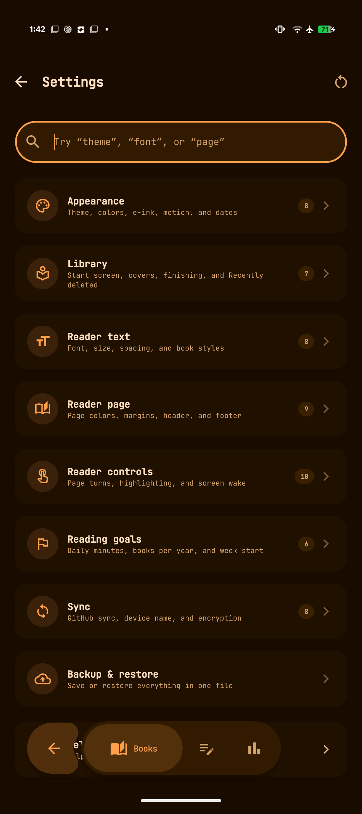 
  Os grupos de configurações com busca separam opções globais das específicas do leitor.

## Diagnóstico e suporte

Abra **Configurações → Ajuda e sobre → Diagnóstico** quando o aplicativo falhar ou a sincronização se comportar de forma inesperada.

O Diagnóstico registra localmente falhas não tratadas e problemas recentes de sincronização. A tela mostra contagens, eventos do mais recente ao mais antigo e detalhes técnicos expansíveis. Também oferece:

- **Compartilhar com o desenvolvedor** para abrir o painel de compartilhamento do Android com um relatório em texto simples
- **Copiar relatório** para colocá-lo na área de transferência
- **Limpar todos os registros** para remover do dispositivo os eventos de diagnóstico armazenados

O relatório gerado inclui versão do aplicativo, versão do Android, modelo do dispositivo, horários dos eventos, origens, mensagens e rastros técnicos. Não inclui conteúdo privado dos livros, notas ou configurações. Valores comuns de autorização, parâmetros secretos de URL, padrões de tokens GitHub, caminhos de usuário, caminhos de arquivos externos, URIs de conteúdo e endereços de e-mail são ocultados. Sempre revise o relatório antes de compartilhá-lo.

Ao relatar um problema, inclua:

- O que você estava fazendo
- O que esperava
- O que aconteceu no lugar disso
- Se acontece sempre
- O formato do livro e se afeta um ou todos os livros
- O relatório de diagnóstico, quando relevante

Nunca publique um token GitHub ou a frase secreta de sincronização em uma issue.

<table>
  <tr>
    <td width="50%" align="center">
      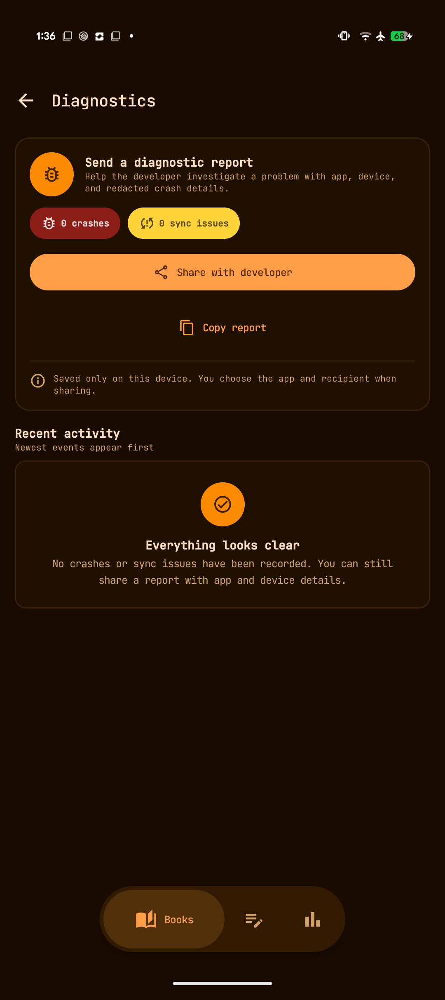 
      <strong>Diagnóstico</strong>: revise e compartilhe informações de falhas ou sincronização com dados sensíveis ocultados.
    </td>
    <td width="50%" align="center">
      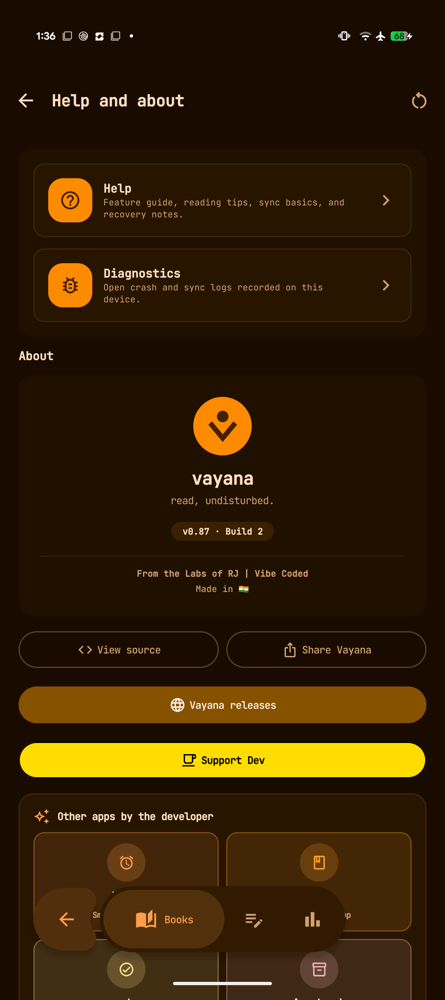 
      <strong>Sobre</strong>: versão, código-fonte, versões publicadas, suporte, compartilhamento e links do desenvolvedor.
    </td>
  </tr>
</table>

Relate problemas reproduzíveis pelo [GitHub Issues](https://github.com/rjwarrier/Vayana/issues).

## Privacidade e serviços on-line

Leitura básica, busca local, notas, dicionário off-line, estatísticas e backup local funcionam sem uma conta Vayana.

O acesso à rede ocorre quando você escolhe ou configura um recurso on-line:

| Recurso | Dados envolvidos |
| --- | --- |
| Project Gutenberg | Solicitações de busca/filtro e downloads de livros |
| OPDS | Endereço do catálogo, solicitações de navegação/busca, autenticação opcional do servidor e downloads |
| Goodreads | Consulta de metadados/capas de livros e alternativa pelo navegador |
| Wiktionary/Wikipedia | A palavra ou frase selecionada quando você solicita uma consulta |
| Tradução | Texto selecionado enviado ao aplicativo/provedor de tradução escolhido |
| Sincronização com o GitHub | Metadados de sincronização e arquivos de livros/capas criptografados com AES-GCM; os identificadores do repositório e o token permanecem nas configurações do aplicativo no dispositivo |
| Busca de capas | Metadados de busca do livro necessários para a fonte escolhida |

Os registros de diagnóstico ficam no dispositivo até você copiá-los, compartilhá-los ou apagá-los explicitamente. O aplicativo destinatário escolhido no Android controla o que acontece após o compartilhamento.

## Solução de problemas

### Um livro não é importado

- Confirme que seja um EPUB ou PDF válido e que outro leitor consiga abri-lo.
- PDFs protegidos por senha não são compatíveis.
- Se o Android informar um tipo de arquivo genérico, mantenha a extensão `.epub` ou `.pdf`.
- Tente o seletor de arquivos do Vayana em vez de Compartilhar/Abrir com.
- Verifique o armazenamento disponível e conceda acesso ao arquivo ou à pasta selecionados.

### Um livro sumiu depois de mover os arquivos

- Abra Detalhes do livro e use **Substituir origem** para reconectar o registro.
- Se ele foi excluído permanentemente do Vayana, importe o arquivo novamente.
- Verifique **Excluídos recentemente** se foi removido há pouco e restaure-o ali.

### Project Gutenberg ou OPDS não carrega

- Verifique a conexão com a Internet e tente novamente.
- O Project Gutenberg pode responder lentamente; o Vayana pode mostrar o catálogo salvo enquanto estiver off-line.
- No OPDS, verifique a URL exata do catálogo e se o servidor está acessível.
- Se a autenticação falhar, confirme as credenciais do servidor fora do Vayana.

### O dicionário ou a tradução não está disponível

- Confirme que o idioma do livro esteja correto nos metadados.
- Os resultados off-line dependem dos dados do dicionário instalado/incluído.
- A alternativa Wikimedia exige acesso à Internet.
- A tradução exige um aplicativo compatível.

### A leitura em voz alta não tem voz

- Instale ou ative um mecanismo TTS do Android e a voz do idioma necessário.
- Verifique o volume de mídia e a saída Bluetooth.
- Confira mecanismo, voz, idioma, velocidade e tom nas configurações de leitor/áudio.
- Em dispositivos E-Ink, confirme que **Recursos de áudio** esteja ativado.

### A sincronização com o GitHub falha

- Abra **Configurações → Sincronização** e execute **Testar conexão com o GitHub**.
- Confirme proprietário, repositório, branch, token e frase secreta.
- Garanta que o token tenha acesso ao repositório configurado.
- Use a mesma frase secreta em todos os dispositivos.
- Abra o Diagnóstico e compartilhe o evento de sincronização com dados sensíveis ocultados se o erro continuar sem explicação.

### As estatísticas parecem incompletas

- Apenas sessões registradas pelo Vayana são contadas.
- Confirme que o livro esteja sendo aberto pelo Vayana e que o relógio do dispositivo esteja correto.
- Execute a sincronização se a atividade foi registrada em outro dispositivo configurado.

### O aplicativo falhou

1. Abra o Vayana novamente.
2. Vá a **Configurações → Ajuda e sobre → Diagnóstico**.
3. Expanda a falha mais recente e confirme se o horário corresponde.
4. Use **Compartilhar com o desenvolvedor** ou **Copiar relatório**.
5. Descreva a ação imediatamente anterior à falha.

## Limitações atuais

- Os formatos digitais de leitura compatíveis são EPUB e PDF.
- PDFs digitalizados sem camada de texto não oferecem seleção, consultas, busca ou anotações de texto.
- A tipografia PDF é definida pelo documento; os controles de fonte e espaçamento EPUB não se aplicam.
- O suporte a PDF ainda não inclui todos os recursos exclusivos de EPUB, como leitura biônica ou citações da comunidade.
- PDFs protegidos por senha não são compatíveis.
- O conteúdo de livros físicos e o texto das páginas PDF não fazem parte da indexação do livro completo.
- Os SDKs de atualização E-Ink específicos de fabricantes não estão integrados.
- O histórico Git pode manter arquivos criptografados em commits antigos de sincronização após uma exclusão permanente na nuvem, a menos que o histórico do repositório seja reescrito.
- Os recursos on-line de catálogo, enriquecimento, consultas, tradução e sincronização dependem da disponibilidade de serviços de terceiros.

## Documentação relacionada

- [Comportamento dos recursos e detalhes de implementação](FEATURES.md)
- [Configuração da sincronização com o GitHub](GITHUB_SYNC_SETUP.md)
- [Decisões de arquitetura e implementação](DECISIONS.md)
- [Histórico de alterações do banco de dados](DATABASE_CHANGELOG.md)
- [Versão 0.90 do Vayana](https://github.com/rjwarrier/Vayana/releases/tag/v0.90)
